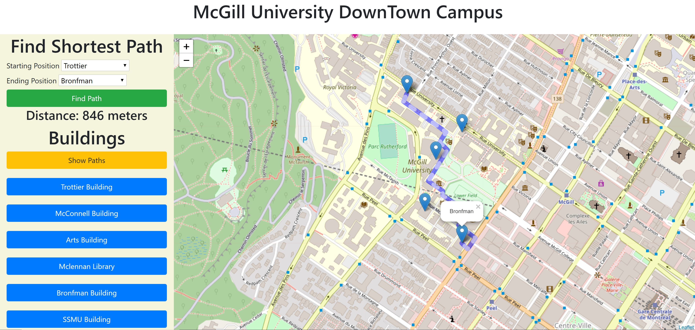

## McGill Tour

This is a personal project I worked on using maps. The website can find the shortest path between two building on McGill University Campus. I am using Dijkstra Algorithm to find the shortest Path. Building (points) and paths (edges) are all defined in geojson format.
 

## Technologies used to develop
1. Flask
2. Leaflet
3. Git
4. waffle.io
5. Atom

## Programming Language
1. Python
2. html
3. javascript
4. CSS

## Libraries
1. turf.js
2. leaflet.js
